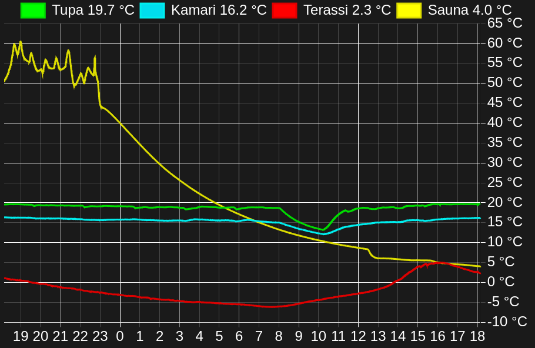

# MQTT Thermometer

The goal of this project is to monitor temperature from various sources using MQTT topics. The temperatures will be stored in a local database and displayed on a web page for the last 24 hours.



# Prerequisites

MQTT broker (for example https://mosquitto.org/) must be installed and running.

## Run locally

Use recent enough version of Python. This project is developed using Python 3.12.

```bash
python -m venv env
source env/bin/activate
pip install -r requirements.txt
sh start-service.sh
```

--> Navigate to http://localhost:8000.

## Install on Debian based Linux server

For example Raspberry Pi.

```bash
mkdir -p /srv/mqtt-thermometer
cd /srv/mqtt-thermometer
git clone https://github.com/jvuori/mqtt-thermometer.git .
python -m venv env
source env/bin/activate
pip install -r requirements.txt
```

Configure `mqtt-thermometer.toml` file.

Install and start service:

```bash
sh setup-service.sh
systemctl start mqtt-thermometer
```

Note: `mqtt-thermometer.service` assumes that Mosquitto is running on the same server. Adjust the file accordingly if you are running it on a different server.
